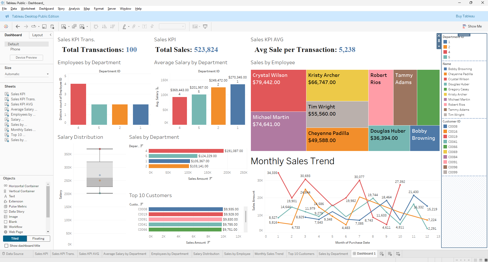

# Employees Sales Analysis

## Overview
Analysis of company sales performance to identify trends and improve sales strategies. Built as part of the DEPI Diploma program.

## Data Sources
- `sales_data.csv`: Sales transactions and customer information
- `employee_data.csv`: Employee details and department information

## Key Features
- Data cleaning and preparation using Python
- SQL analysis for sales performance metrics
- Employee performance tracking
- Department-wise analysis
- Customer purchase patterns

## Analysis Tasks
1. **Data Cleaning**
   - Standardize sales amounts and dates
   - Clean employee records
   - Handle missing data

2. **SQL Analysis**
   - Total sales per employee
   - Top performing employees
   - Department salary analysis
   - Employee-supervisor relationships
   - High-value customer identification
